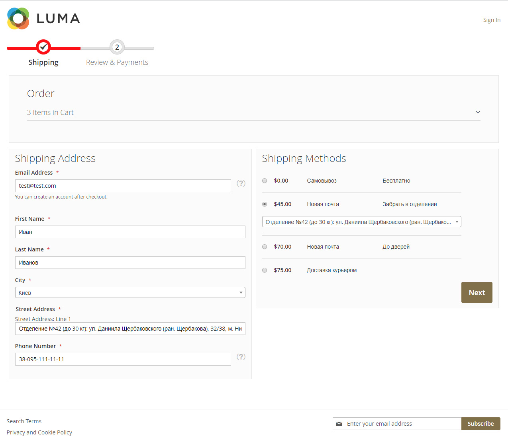

# Yu_Checkout for Magento 2

## Step 1


## Step 2


### Installation

Copy files of module to folder `app/code/Yu/Checkout`.

Run these commands in your terminal:

```
php bin/magento module:enable Yu_Checkout
php bin/magento setup:upgrade
```


### Support 
email: yuriy.akishin@gmail.com  
skype: yuriy-a76